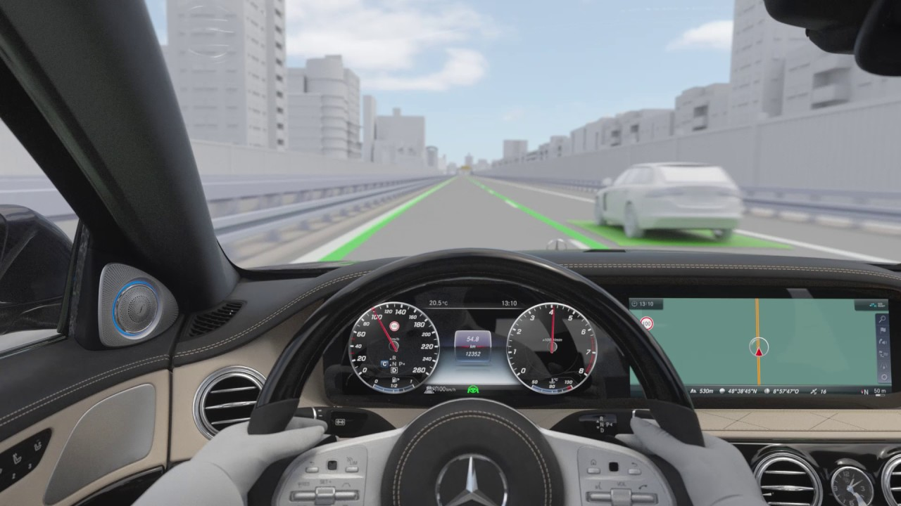
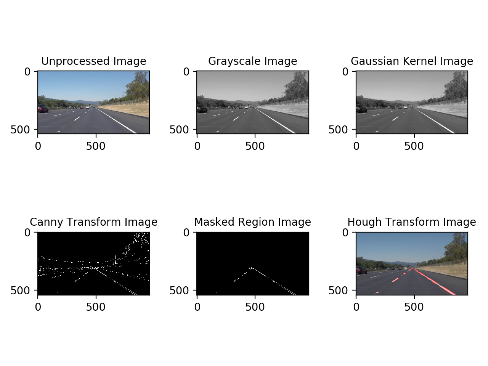

# Self-Driving Car Project: Lane Lines Detection on the Road

Hello there! I'm Babak. Let me introduce you to my project. In this project lane lines on the road are automatically detected, this is the first step in developing a self-driving car. Algorithm for this project is written in Pyhton using OpenCV, numpy, glob and matplotlib libraries. The algorithm was tested on both actual images and videos.

**Contents**   

* Python script 
* IPython notebook
* Test_input folder
* Test_output folder
* Readme folder

### Pipeline:
The pipeline for detecting lane lines on the road is as follows:

1. Reading the input images/videos from the test_input folder.
2. Apply grayscale transform to convert RGB into grayscale.
3. Reducing noise using Gaussian noise kernel.
4. Apply Canny transform to get edges.
5. Mask the image and apply region of interest.
6. Apply Hough transform to find lines and drawing lines on the image with the desired color and thickness.
7. Blending the Hough output image and the unprocessed image.
8. Plotting and saving the output images/videos into the test_output folder.

Main stages of lane line detection can be seen below: 

### improvements:

A possible improvement is finding solution for when the input image and video is not flat and is somewhat distorted, also updating the algorithm so it can detect any lane lines whether straight or curved.
